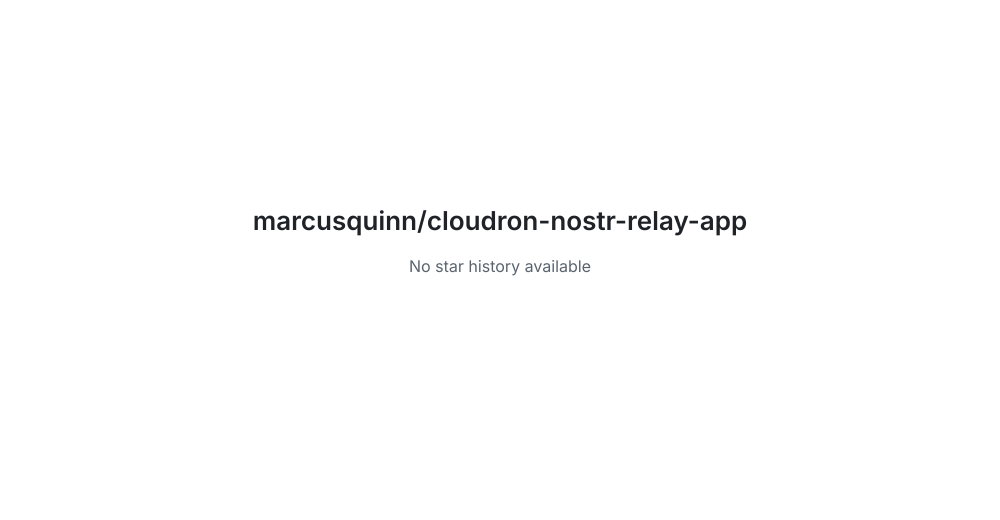

# Private Nostr Relay for Cloudron

<!-- aidevops:badges:start -->
<!-- managed by aidevops badges; edit the template, not this block -->
<!-- Build & Quality Status -->
[](https://github.com/marcusquinn/cloudron-nostr-relay-app/actions/workflows/loc-badge.yml)

<!-- License & Legal -->
[](https://github.com/marcusquinn/cloudron-nostr-relay-app/blob/main/LICENSE)

<!-- Repository Metrics -->
[](docs/metrics/repo-metrics.md)
[](docs/metrics/repo-metrics.md)
[](docs/metrics/repo-metrics.md)

<!-- Project Links -->
[](https://github.com/marcusquinn/cloudron-nostr-relay-app)
<!-- aidevops:badges:end -->
This package runs [strfry](https://github.com/hoytech/strfry) as a Nostr relay
behind Cloudron TLS. It accepts writes only from public keys listed in the
operator-managed allowlist; an empty allowlist rejects every write.

## Quick start

1. Install the app in Cloudron.
2. Add writer public keys to `/app/data/allowlist.txt` using the Cloudron File
   Manager or `cloudron exec`.
3. Point Nostr clients at `wss://<app-domain>/`.

The relay database and allowlist are stored in `/app/data` and included in
Cloudron backup and restore. See the [operator documentation](docs/README.md).

## Development

```bash
cloudron-package-helper.sh validate
cloudron-package-helper.sh check-compatibility
bash test/package-test.sh
bash test/relay-smoke.sh
```

<!-- aidevops:managed-readme:start -->
<!-- managed by aidevops; refresh with managed-readme-helper.sh sync -->
## Star History



## Built with aidevops

This project was created and is maintained with
[aidevops.sh](https://aidevops.sh).

[View marcusquinn on GitHub](https://github.com/marcusquinn) ·
[aidevops repository](https://github.com/marcusquinn/aidevops)
<!-- aidevops:managed-readme:end -->
